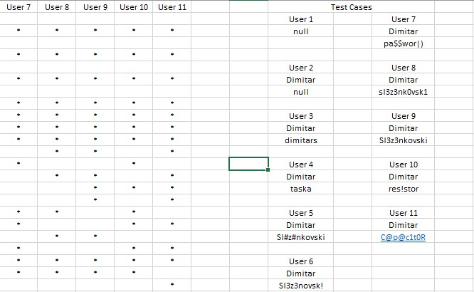

# SI_lab2_183272
## Димитар Слезенковски, број на индекс 183272

**Група на код:**

Ја добив групата на код 3

* Control Flow Graph


* Цикломатска комплексност
Цикломатската комплексност на функцијата е 9.
Истата ја добив со помош на формулата P+1, каде P е бројот на предикатни јазли. Во случајoв P=8, па цикломатската комплексност изнесува 9.

* Тест случаи според критериумот **Every Branch**

Табелата за овој критериум може да ја најдете во репото под име EBC.xlsx. 
Има вкупно 11 тест случаи според овој критериум.



* Тест случаи според критериумот **Every Path**

Табелата за овој критериум може да ја најдете во репото под име EPC.xlsx. 
Има вкупно 11 тест случаи според овој критериум.


* Објаснување на напишаните unit tests

**Every Branch tests**

Inputs -> (Корисничко име, Лозинка, Е-маил)\
User1 (null)\
User2 (Dimitar, null, asd@gmail.com)\
User3 (Dimitar, dimitar, dsa@gmail.com)\
User4 (Dimitar, asdf, "")\
User5 (Dimitar, Pa2$Wor|), p!ck1eR!ck@gmail.com)\
User6 (Dimitar, asdf12, john@gmail.com)\
User7 (Dimitar, dimitar, asdf@gmail.com)\
User8 (Dimitar, dimitar, haos@gmail.com)\
User9 (Dimitar, Slezenkovsk1, nesumodtuka@gmail.com)\
User10 (Dimitar, 1234SADF, "")\
User11 (Dimitar, AWDFA1a, "")\

```
Кај првиот тест случај (User1) вредноста на user објектот е null. Со ова првиот услов од кодот е исполнет и програмата фрла exception. Тестот ги опфаќа A и B јазлите. 

Кај вториот тест случај (User2) вредноста на променливата корисничко име е null со што се задоволува вториот услов од кодот и програмата фрла exception. Тестот ги опфаќа A, C и D јазлите.

Кај третиот тест случај (User3) вредноста на променливата лозинка е null со што се задоволува вториот услов од кодот и програмата фрла exception. Тестот ги опфаќа A, C и D јазлите.

Кај четвртиот тест случај (User4) вредноста на корисничкото име се содржи во вредноста на лозинката. Со тоа се задоволува условот if(passwordLower.contains(user.getUsername().toLowerCase())) и програмата враќа false.  Тестот ги опфаќа A, C, E и F јазлите.

Кај петиот тест случај (User5) вредноста на лозинката е помала од 8 карактери и со условот if(passwordLower.length()<8) е задоволен и програмата враќа false. Тестот ги опфаќа A, C, E, G, и H јазлите.

Kaj шестиот тест случај (User6) имеме објект каде што внесените вредности на променливите се валидни па затоа програмата ќе врати true. Поточно има соодветна внесена вредост за корисничко име и лозинка и дополнително лозинката не е помала од 8 карактери и содржи и бројка и голема буква и спрецијален знак. Овој тест ги опфаќа јазлите A, C, E, G, I, J, K, M, N, O, P, Q, R, L, S и U.

Кај седмиот тест случај (User7) имаме објект каде што променливата лозинка има погрешна вредност (не содржи специјален знак). Поради ова условот if (!digit || !upper || !special) нема да биде задоволен и програмата ќе врати резултат false. Овој тест ги опфаќа јазлите A, C, E, G, I, J, K, M, N, O, P, Q, L, S и Т.

Кај осмиот тест случај (User8) имаме објект каде што променливата лозинка има погрешна вредност (не содржи голема буква). Поради ова условот if (!digit || !upper || !special) нема да биде задоволен и програмата ќе врати резултат false. Овој тест ги опфаќа јазлите A, C, E, G, I, J, K, M, N, O, Q, R, L, S и Т.

Кај деветиот тест случај (User9) имаме објект каде што променливата лозинка има погрешна вредност (не содржи бројка). Поради ова условот if (!digit || !upper || !special) нема да биде задоволен и програмата ќе врати резултат false. Овој тест ги опфаќа јазлите A, C, E, G, I, J, K, M, O, P, Q, R, L, S и Т.

```

**Every Path tests**

Inputs -> (Корисничко име, Лозинка, Е-маил)\
User1 (null)\
User2 (Dimitar, null, asd@gmail.com)\
User3 (Dimitar, dimitar, dsa@gmail.com)\
User4 (Dimitar, asdf, "")\
User5 (Dimitar, Pa2$Wor|), p!ck1eR!ck@gmail.com)\
User6 (Dimitar, asdf12, john@gmail.com)\
User7 (Dimitar, dimitar, asdf@gmail.com)\
User8 (Dimitar, dimitar, haos@gmail.com)\
User9 (Dimitar, Slezenkovsk1, nesumodtuka@gmail.com)\
User10 (Dimitar, 1234SADF, "")\
User11 (Dimitar, AWDFA1a, "")\

```
Кај првиот тест случај (User1) вредноста на user објектот е null. Со ова првиот услов од кодот е исполнет и програмата фрла exception. Тестот ги опфаќа A и B јазлите. 

Кај вториот тест случај (User2) вредноста на променливата лозинка е dimitar со што се задоволува вториот услов од кодот и програмата фрла exception. Тестот ги опфаќа A, C и D јазлите.

Кај треттиот тест случај (User3) вредноста на променливата лозинка е asdf со што се задоволува треттиот услов од кодот и програмата фрла exception. Тестот ги опфаќа A, C и Е јазлите.

Кај четврттиот тест случај (User4) вредноста на корисничкото име се содржи во вредноста на лозинката. Со тоа се задоволува условот if(passwordLower.contains(user.getUsername().toLowerCase())) и програмата враќа false.  Тестот ги опфаќа A, C, E и F јазлите.

Кај петтиот тест случај (User5) вредноста на лозинката е помала од 8 карактери и со условот if(passwordLower.length()<8) е задоволен и програмата враќа false. Тестот ги опфаќа A, C, E, G, и H јазлите.

Kaj шесттиот тест случај (User6) имеме објект каде што внесените вредности на променливите се валидни па затоа програмата ќе врати true. Поточно има соодветна внесена вредост за корисничко име и лозинка и дополнително лозинката не е помала од 8 карактери и содржи и бројка и голема буква и спрецијален знак. Овој тест ги опфаќа јазлите A, C, E, G, I, J, K, M, N, O, P, Q, R, L, S и U.

Кај седмиот тест случај (User7) имаме објект каде што променливата лозинка има погрешна вредност (не содржи специјален знак). Поради ова условот if (!digit || !upper || !special) нема да биде задоволен и програмата ќе врати резултат false. Овој тест ги опфаќа јазлите A, C, E, G, I, J, K, M, N, O, P, Q, L, S и Т.

Кај осмиот тест случај (User8) имаме објект каде што променливата лозинка има погрешна вредност (не содржи голема буква). Поради ова условот if (!digit || !upper || !special) нема да биде задоволен и програмата ќе врати резултат false. Овој тест ги опфаќа јазлите A, C, E, G, I, J, K, M, N, O, Q, R, L, S и Т.

Кај деветтиот тест случај (User9) имаме објект каде што променливата лозинка има погрешна вредност (не содржи бројка). Поради ова условот if (!digit || !upper || !special) нема да биде задоволен и програмата ќе врати резултат false. Овој тест ги опфаќа јазлите A, C, E, G, I, J, K, M, O, P, Q, R, L, S и Т.

Кај десеттиот тест случај (User10) имаме објект каде што променливата лозинка има погрешна вредност (не содржи буква). Поради ова условот if (!digit || !upper || !special) нема да биде задоволен и програмата ќе врати резултат false. Овој тест ги опфаќа јазлите A, C, E, G, I, J, K, M, N, O, P, Q, L, S и Т.

Кај единаесеттиот тест случај (User11) имаме објект каде што променливата лозинка има погрешна вредност (не содржи буква). Поради ова условот if (!digit || !upper || !special) нема да биде задоволен и програмата ќе врати резултат false. Овој тест ги опфаќа јазлите A, C, E, G, I, J, K, M, N, O, P, Q, L, S и Т.

```
